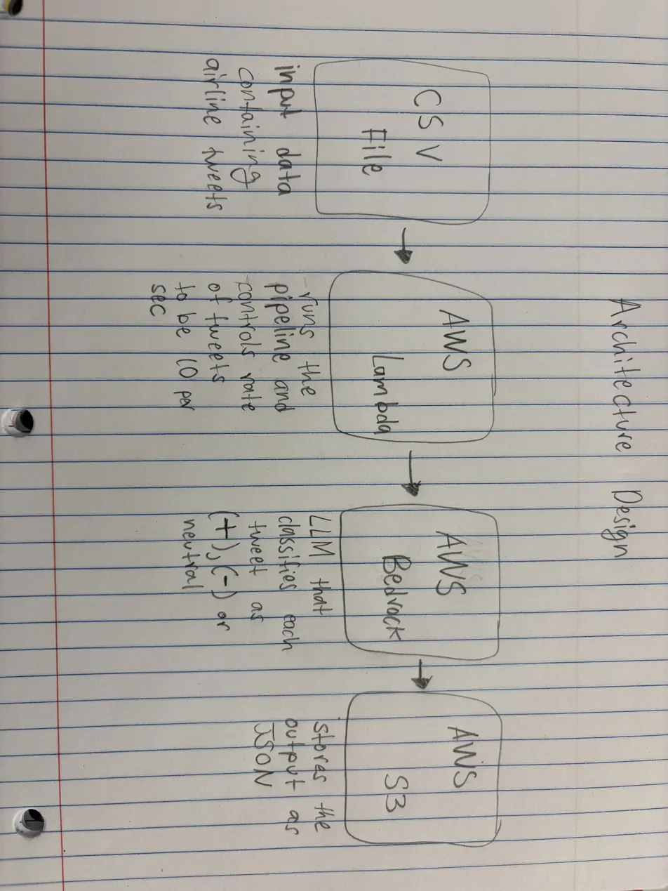

# Airline Sentiment Analysis - Architecture Design

## Overview
This system takes airline tweets from a CSV file, analyzes the sentiment of each tweet using an AI model, and saves the results. Each tweet is classified as positive, negative, or neutral, and the pipeline processes a minimum of 100 tweets at a max rate of 10 per second.

## AWS Services
- **CSV File**: The input data containing the tweets that need to be analyzed
- **AWS Lambda**: Controls the pipeline, sends each tweet onwards and limits the max processing rate to be 10 tweets per second
- **AWS Bedrock**: The LLM that classifies each tweet as positive, negative, or neutral based on the prompt
- **AWS S3**: Stores the final output as a JSON file

## Architecture Design

## Data Flow
1. Lambda reads the CSV file and randomly selects 100 tweets or more without replacement
2. For each tweet, Lambda builds a prompt and sends it to Bedrock
3. Bedrock returns a classification based on sentiment: positive, negative, or neutral
4. Lambda makes sure each call doesn't go over the rate limit
5. Results are written to a JSON file

## Prompt Design
The LLM is given the same instructions and a message for each tweet.
Instruction: You are a sentiment classifier for airline tweets. Classify the sentiment as exactly one of: positive, negative, or neutral. Respond with only one word.
User Message:
Tweet: "{tweet text here}"
Sentiment:

## Design Decisions
- **S3 vs RDS**: S3 outputs a flat list with no structure, so it's easier to set up a simple JSON file
- **Lambda vs Step Functions**: Lambda is simpler for a single linear pipeline
- **Single-word output**: Asking the model to respond with one word makes parsing the result reliable and easy
